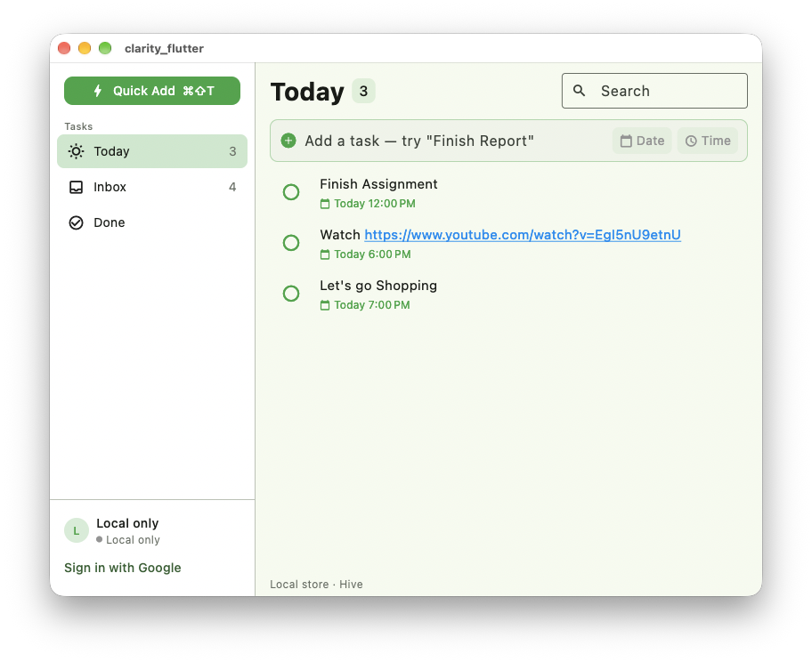
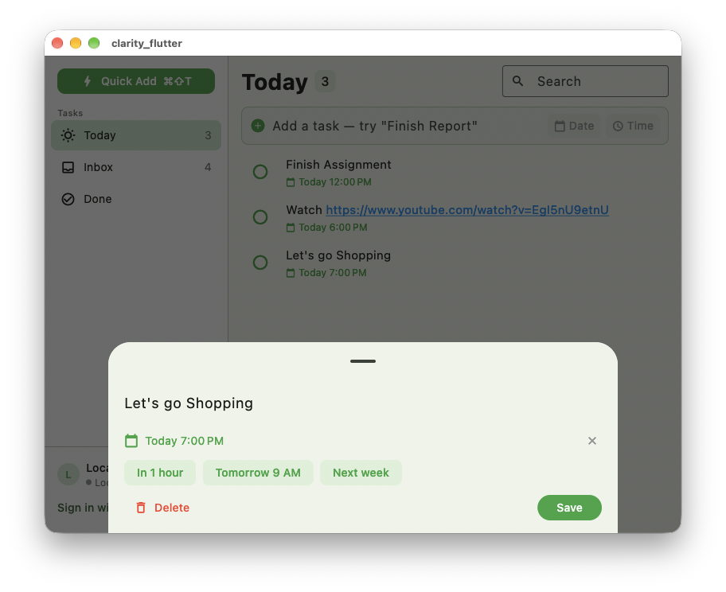
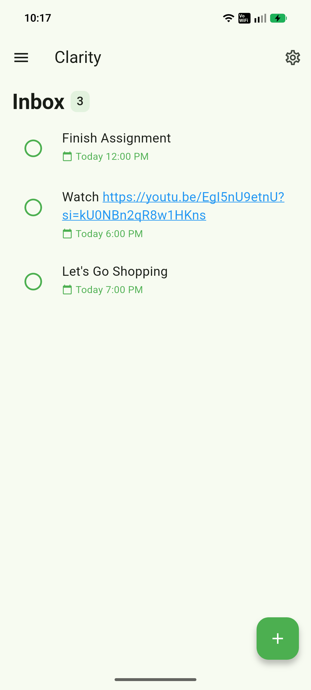

# Clarity Flutter

![License][badge-license]
[![Flutter][badge-flutter]](https://docs.flutter.dev)
[![Platforms][badge-platforms]](#-platform-support)

[badge-license]: https://img.shields.io/github/license/hariprasad2512/clarity_flutter?style=flat-square&color=2ea44f
[badge-flutter]: https://img.shields.io/badge/Flutter-3.47-54c5f8?logo=flutter&logoColor=white&style=flat-square
[badge-platforms]: https://img.shields.io/badge/platforms-macOS%20%7C%20Android%20%7C%20iOS%20%7C%20Windows%20%7C%20Linux%20%7C%20Web-6b7280?style=flat-square

A minimal, open-source todo app. **Capture fast, track simply, sync everywhere.**

This is the cross-platform Flutter port of the native macOS
[Clarity](https://github.com/hariprasad2512/Clarity) app (SwiftUI). It keeps
the same philosophy — **local-first, minimal by design, no feature bloat** —
and obeys the same data contract (`public.tasks`, per-user RLS,
last-write-wins on `updated_at`).

## ✨ Features

- **Focused workspace** — Today, Inbox, and Done views with counts, responsive
  layouts, overdue highlighting, dark mode, links, and swipe-to-delete.
- **Natural dates + scheduling** — parse phrases like `tomorrow at 5pm`, then
  refine them with a calendar or Today / Tomorrow / Weekend presets.
- **Quick task editing** — change titles, dates, times, or reminder presets in
  a focused detail sheet.
- **Actionable local alerts** — mark tasks done or snooze them directly from
  notifications; every signed-in device schedules its own reminders.
- **Live two-way sync** — Google sign-in and Supabase keep devices aligned
  offline-first, with last-write-wins conflict resolution.
- **Widgets + desktop extras** — Android home-screen widgets, Quick Add, global
  hotkeys, tray presence, and launch-at-login support.
- **Privacy-first by default** — local Hive storage works fully offline, with
  no account or tracking required.

## 📊 Platform support

| Capability | macOS | Android | iOS | Windows | Linux | Web |
|---|---|---|---|---|---|---|
| Offline tasks, NLP dates, capture | ✅ | ✅ | ✅ | ✅ | ✅ | ✅ |
| Edit sheet, links, swipe delete | ✅ | ✅ | ✅ | ✅ | ✅ | ✅ |
| Local notifications + actions | ✅ | ✅ | ✅ | ✅ | ✅ | ❌¹ |
| Google sign-in + Supabase sync | ✅ | ✅ | ✅ | ✅ | ✅ | ✅ |
| Hotkey / tray / Quick Add | ✅ | — | — | ✅ | ✅ | — |
| Home-screen widgets | — | ✅ | — | — | — | — |

¹ Web has no scheduler backend in `flutter_local_notifications`; the app
runs fully otherwise. macOS and Android are the primary verified platforms.

## 📸 Screenshots

| Today (desktop) | Edit sheet | Android |
|---|---|---|
|  |  |  |

## 🛠️ Tech stack

[![Flutter][badge-flutter]](https://docs.flutter.dev) [](https://dart.dev) [](https://riverpod.dev) [](https://pub.dev/packages/hive_ce) [](https://supabase.com)

| Layer | Choice |
|---|---|
| UI framework | Flutter 3.47+ / Dart |
| State | Riverpod (`flutter_riverpod`) |
| Local store | Hive CE (offline-first source of truth) |
| Cloud | Supabase (Google Auth, Postgres, RLS) |
| Notifications | `flutter_local_notifications` + `timezone` |
| Android background | `workmanager`, `home_widget` |
| Desktop shell | `window_manager`, `tray_manager`, `hotkey_manager`, `launch_at_startup` |
| Links | `url_launcher` |
| Tests | `flutter_test` (unit + widget) |

## 🧭 Architecture

```text
lib/
├── main.dart            # entrypoints, DI overrides, foreground sync loop
├── core/                # TaskListNotifier, TodoTask, DateParser, AppConfig
├── data/                # LocalStore (Hive)
├── sync/                # SyncEngine, TaskRemote, delete outbox, backoff
├── notifications/       # schedule/cancel, prefs reminder cache, restore worker
├── auth/                # Google sign-in → Supabase session
├── desktop/             # tray, hotkey, Quick Add window, launch at login
├── widget/              # Android home-screen widget service + refresh worker
└── ui/                  # shell, sidebar, task list, composer, detail sheet
```

**Data flow.** The notifier owns state; every mutation persists to Hive,
reschedules notifications, refreshes the widget, and debounced-pushes
(`pushSoon`, 1.2s). A 15s foreground loop pulls: push pending upserts →
flush queued hard deletes → fetch all → last-write-wins merge on
`updated_at` → prune local copies gone from the server (never unpushed
edits) → reschedule. Failures surface via sync status + `lastError` with a
coalesced 5s retry and backoff to ~60s while offline.

**Notifications.** Pure local scheduling (`zonedSchedule`,
`exactAllowWhileIdle` with inexact fallback when the permission is denied).
Android adds boot/update receivers plus a prefs-backed Workmanager restore
(no Hive in background isolates). Notification taps cold-start the app when
killed and apply on launch.

## 🚀 Getting started

### Prerequisites

- [Flutter](https://docs.flutter.dev/get-started/install) 3.47+
  (`flutter --version`)
- macOS builds: Xcode 16+ (run `sudo xcodebuild -license accept` once).
  Android: Android Studio + SDK. Windows: VS Build Tools.

### Setup

```sh
git clone https://github.com/hariprasad2512/clarity_flutter.git
cd clarity_flutter
flutter pub get
cp .env.example .env   # then fill in your keys (table below)
```

| Key | Where to find it | Required for |
|---|---|---|
| `SUPABASE_URL` | Supabase Dashboard → Project Settings → API | Cloud sync |
| `SUPABASE_ANON_KEY` | Same page (anon/public key) | Cloud sync |
| `GOOGLE_WEB_CLIENT_ID` | Google Cloud Console (OAuth web client) | Google sign-in |
| `GOOGLE_IOS_CLIENT_ID` | `GoogleService-Info.plist` client ID | macOS/iOS sign-in |

Without keys the app runs fully local-only (Hive + notifications, no login
gate in debug). Never commit real values — `.env`, `google-services.json`,
`GoogleService-Info.plist` and release keystores are gitignored.

### Database

Apply the migrations in `supabase/migrations/` (Dashboard → SQL Editor, or
`supabase db push`): the `updated_at` auto-touch trigger and the
**delete-own-tasks** RLS policy. Without the DELETE policy, server deletes
are denied — swipe-deletes stay queued and keep retrying instead of
propagating.

### Run

> ⚠️ Always pass `--dart-define-from-file=.env` — without it the build
> silently drops to local-only ("Local only" in the sidebar footer).

```sh
flutter run -d macos --dart-define-from-file=.env     # macOS
flutter run -d android --dart-define-from-file=.env   # Android device
flutter run -d ios --dart-define-from-file=.env       # iOS simulator
flutter run -d windows --dart-define-from-file=.env   # Windows desktop
flutter run -d chrome --dart-define-from-file=.env    # Web
```

### Verify

```sh
flutter test      # unit + widget tests
dart analyze      # must report "No issues found"
```

## 🔔 Notifications

- Permission is requested on first launch (best-effort, never blocks); exact
  alarms are requested on Android 12+ for precise due-time firing.
- Alerts re-register on every launch and after reboot/update (Android boot
  receivers + prefs-cache restore worker).
- Tapping **Mark Done** completes the task; **Remind me later** pushes it
  out by your Settings delay. Taps cold-start the app first when killed —
  actions apply on launch (Hive boxes can't open in two isolates).
- Settings shows device-alert status (notifications on/off, exact alarms
  allowed/denied with inexact fallback). On Samsung/Xiaomi/Oppo also allow
  "Alarms & reminders" and unrestricted battery for on-time firing.

## 🗺️ Roadmap

- ✅ Phases 0–1 — foundation, offline core + UI
- ✅ Phase 2 — actionable local notifications
- ✅ Phase 3 — Supabase Auth (Google) + Postgres sync
- ✅ Phase 4 — desktop extras (hotkey, tray, launch at login)
- ✅ Phase 5 — home-screen widgets, release packaging
- ✅ Live sync (15s/backoff/focus/flush), delete propagation, edit sheet
- 🔜 iOS widget + release hardening, `docs/screenshots/`, store listings

## 🤝 Contributing

See [CONTRIBUTING.md](CONTRIBUTING.md) — setup, branch + commit conventions,
PR checklist, and the no-secrets rule. Active development happens on
`develop-ai`; `main` is release-ready.

## 📄 License

MIT — see [LICENSE](LICENSE).
